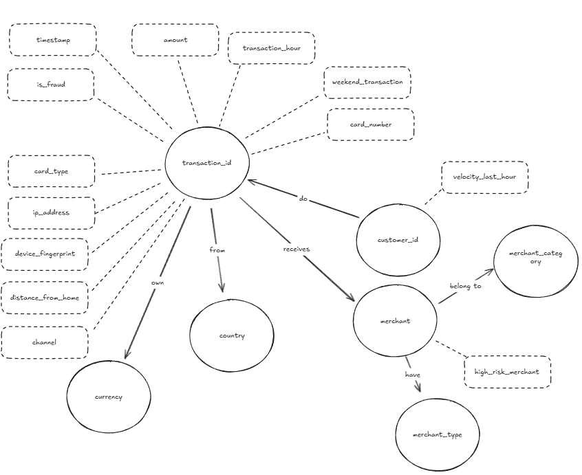

# English

# Fraud Analysis with Neo4j

This project implements a **financial transactions graph** using Neo4j, aiming to identify fraud patterns.

## Repository Structure
- `scripts/01_create_nodes.cypher` → creation of fixed nodes (currencies, countries, merchant categories and types)
- `scripts/02_load_csv.cypher` → import of merchants, transactions and customers from the `fraud.csv` dataset
- `scripts/03_create_relationships.cypher` → relationships between merchants, transactions, countries, currencies and customers
- `scripts/04_set_attributes.cypher` → setting additional attributes for merchants, customers and transactions
- `data/fraud.csv` → dataset used

## Authors
- **Nicolas Montovani**  
- **Daniel Reis**

## Graph Diagram

## Neo4j Visualization Example

---

# Português

# Análise de Fraudes com Neo4j

Este projeto implementa um **grafo de transações financeiras** utilizando o Neo4j, com o objetivo de identificar padrões de fraude.

## Estrutura do Repositório
- `scripts/01_create_nodes.cypher` → criação dos nós fixos (moedas, países, categorias e tipos de comerciantes)
- `scripts/02_load_csv.cypher` → importação de merchants, transações e clientes do dataset `fraud.csv`
- `scripts/03_create_relationships.cypher` → relacionamentos entre merchants, transações, países, moedas e clientes
- `scripts/04_set_attributes.cypher` → definição de atributos adicionais para merchants, customers e transações
- `data/fraud.csv` → dataset utilizado

## Autores
- **Nicolas Montovani**  
- **Daniel Reis**

## Diagrama do Grafo

## Exemplo de Visualização no Neo4j

